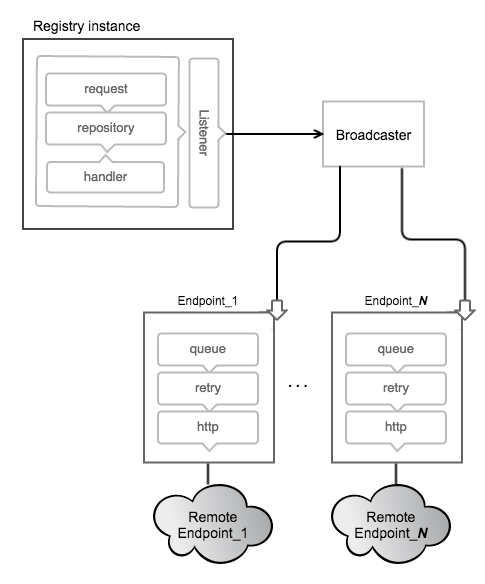

registry-notification-server
============================

`registry-notification-server` is a notification server of docker registry that receives manifest events and stores them in MongoDB for search, migration and analysis.

## Overview

> The Registry supports sending webhook notifications in response to events
> happening within the registry. Notifications are sent in response to manifest
> pushes and pulls and layer pushes and pulls. These actions are serialized into
> events. The events are queued into a registry-internal broadcast system which
> queues and dispatches events to Endpoints.
> [...]
> Notifications are sent to endpoints via HTTP requests.



`registry-notification-server` implements [the above event notification protocol](https://docs.docker.com/registry/notifications/) and provides some simple functions.

## Prerequisites

This server assumes the following:

  * This notification server is designed for internal use, so it uses http instead of https, but still, it can be easily expanded to https using [http.ListenAndServeTLS](https://golang.org/pkg/net/http/#Header)

## Detail

The registry notification server listens for events coming from a docker registry v2, upon receiving an event, it inspects the event and inserts the pull or push records and repository informations into a Mongo database. The information stored in MongoDB support these functions:

  * Repository and Tag Search
  * Pull and Push Logs Search
  * Docker Registry Migration
  
## Build the tool on your own

These instructions walk you through compiling this project to create a single standalone binary that you can copy and run almost wherever you want.

```
$ git clone https://github.com/duyanghao/registry-notification-server.git $GOPATH/src/github.com/duyanghao/registry-notification-server
$ cd $GOPATH/src/github.com/duyanghao/registry-notification-server && go build
```

## Run

```
./registry-notification-server ./examples/config.yml
```

## Suggestion

This is only a demo implemented as docker registry event notification endpoint, which still needs further enhancement.

## Refs

* [Docker Registry Event Collector](https://github.com/kwk/docker-registry-event-collector)
* [registry event notifications to HTTP endpoints](https://docs.docker.com/registry/notifications/)